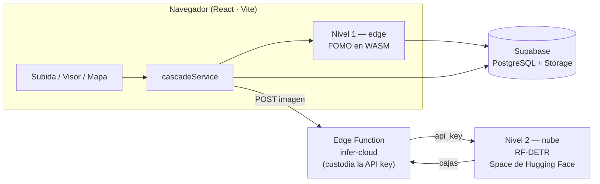

# PlasticWatch

Aplicación web para la detección de residuos plásticos en imágenes aéreas de zonas costeras, mediante un **sistema de detección en dos niveles (*edge* + nube)**.

🔗 **Demo pública:** https://coastwatch-ai.lovable.app

PlasticWatch es el artefacto de ingeniería del Trabajo Fin de Estudios *«Detección de residuos plásticos en zonas costeras mediante aprendizaje profundo y drones: un sistema de detección en dos niveles edge–nube»* (Máster Universitario en Inteligencia Artificial, UNIR), desarrollado en colaboración con el proyecto **ECOS** de la Universidade Federal Fluminense (Brasil) sobre el litoral del Norte Fluminense.

---

## El problema y el enfoque

A las altitudes de vuelo útiles (5–12 m) el plástico aparece en la imagen como objetos diminutos. Ninguno de los modelos que caben a bordo de un dron alcanza por sí solo precisión suficiente, y los modelos que sí la alcanzan no caben en el hardware embarcado.

PlasticWatch materializa la solución propuesta en el TFE: **encadenar dos modelos** en lugar de elegir uno.

| | Nivel 1 — *edge* | Nivel 2 — nube |
|---|---|---|
| **Modelo** | FOMO (Edge Impulse), 640×640 | RF-DETR-medium (Roboflow), 1024 px |
| **Dónde corre** | En el navegador, sobre WebAssembly | Servidor de inferencia auto-hospedado |
| **Función** | Criba: ¿hay plástico en este fotograma? | Detección precisa de cajas |
| **Rendimiento** | *recall* de fotograma 0,96 | mAP@50 = 0,82 |
| **Latencia observada** | ~0,6 s por imagen (en caliente) | ~5 s por imagen |

La idea es que el Nivel 1 filtre a coste casi nulo y solo los fotogramas con plástico lleguen al Nivel 2, que es el caro. En un vuelo de monitorización con prevalencia baja de plástico (5–20 % de los fotogramas), esto ahorra un 61–71 % del ancho de banda y del cómputo en nube perdiendo muy poco *recall*.

> [!NOTE]
> **Esta aplicación es un demostrador comparativo, no el sistema embarcado.** Ejecuta **ambos** niveles sobre **cada** imagen y registra la decisión de criba como métrica analítica («el *edge* habría escalado esta imagen»), en lugar de descartar fotogramas. Así se pueden contrastar los dos niveles lado a lado sobre la misma imagen. El descarte real corresponde al sistema a bordo del dron.

## Arquitectura



El flujo es: **carga → geolocalización (EXIF) → criba en el navegador → escalado a la nube → visualización en mapa**. Las detecciones heredan las coordenadas GPS de los metadatos de cada imagen y se agregan en un mapa interactivo, como pines individuales y como zonas de calor.

La clave de API de Roboflow nunca llega al cliente: vive como secreto de la Edge Function `infer-cloud`, que actúa de pasarela. Los diagramas detallados están en [`docs/cascade/arquitectura.md`](docs/cascade/arquitectura.md).

## Stack

- **Frontend:** Vite · React · TypeScript · shadcn/ui · Tailwind CSS
- **Inferencia *edge*:** *runtime* WebAssembly de Edge Impulse (`public/edge-impulse-standalone.wasm`)
- **Backend:** Supabase — PostgreSQL, Storage, Auth y Edge Functions (Deno)
- **Inferencia en nube:** servidor de inferencia de Roboflow auto-hospedado en un *Space* de Hugging Face (ver [`deploy/hf-space-inference`](deploy/hf-space-inference))
- **Idiomas:** español, inglés y portugués

## Puesta en marcha

Requisitos: Node.js y npm ([instalar con nvm](https://github.com/nvm-sh/nvm#installing-and-updating)).

```sh
git clone https://github.com/ferjm/coastwatch-ai.git
cd coastwatch-ai
npm install
npm run dev          # http://localhost:8080
```

La aplicación necesita las siguientes variables de entorno (fichero `.env`), que apuntan al proyecto de Supabase:

```sh
VITE_SUPABASE_URL="https://<project-ref>.supabase.co"
VITE_SUPABASE_PROJECT_ID="<project-ref>"
VITE_SUPABASE_PUBLISHABLE_KEY="<clave publicable>"
```

> La clave *publishable* (anon) está pensada para viajar al navegador y su seguridad descansa en las políticas RLS de la base de datos; no es un secreto. Las claves privadas (Roboflow, *service role*) viven solo como secretos de las Edge Functions.

Otros comandos:

```sh
npm run test         # tests unitarios (Vitest)
npm run lint         # ESLint
npm run build        # build de producción
```

## Estructura del proyecto

```
src/
  pages/app/         Dashboard, Uploads, MapView, Review, Flights, Areas, Jobs, Models, Settings
  services/
    inference/       cascadeService (orquestador), edgeProvider, cloudProvider, inferenceWorker
    detectionMapper  normalización de coordenadas entre niveles
  components/        UI (shadcn/ui)
  lib/i18n.ts        traducciones es / en / pt
supabase/
  functions/         infer-cloud, invite-user, get-users-with-roles, get-google-maps-key
  migrations/        esquema (imágenes, detecciones, roles, latencias de cascada)
deploy/
  hf-space-inference Dockerfile e instrucciones del Nivel 2 auto-hospedado
docs/cascade/        documentos de diseño y arquitectura
public/              runtime WASM del modelo edge
```

Las coordenadas se normalizan a fracciones 0–1 con origen en la esquina superior izquierda, de modo que las detecciones de ambos niveles se superponen de forma homogénea sobre la imagen original.

## Recursos del TFE

Los modelos y conjuntos de datos son públicos:

| Recurso | Enlace |
|---|---|
| Nivel 1 — proyecto Edge Impulse (12 m + 5 m) | https://studio.edgeimpulse.com/public/1030569/live |
| Nivel 1 — proyecto Edge Impulse (solo 5 m) | https://studio.edgeimpulse.com/public/1030751/live |
| Nivel 2 — Roboflow `coastal-plastic-5m` | https://app.roboflow.com/ecos-u7zcx/coastal-plastic-5m |
| Nivel 2 — Roboflow `tfm-coastal-plastic-combined` | https://app.roboflow.com/ecos-u7zcx/tfm-coastal-plastic-combined |

El dataset se capturó con un dron DJI Mavic 3 Multispectral sobre cinco puntos costeros de São João da Barra (Río de Janeiro, Brasil), a dos altitudes (12 m y 5 m). Se publica con el acuerdo del equipo del proyecto ECOS de la UFF, al que pertenecen los datos de campo.

## Créditos

Autor: **Fernando Jiménez Moreno** — TFE del Máster Universitario en Inteligencia Artificial (UNIR), dirigido por Arturo Peralta Martín-Palomino.

Las capturas de campo y la primera fase de etiquetado son obra del equipo del proyecto ECOS de la Universidade Federal Fluminense: Analice Gomes (ingeniera ambiental), Dra. María Cristina Canela (UENF) y Dr. Benigno Sánchez.

## Licencia

[MIT](LICENSE) © 2026 Fernando Jiménez Moreno.

El código de la aplicación se publica bajo licencia MIT. Los conjuntos de datos y los modelos entrenados se rigen por los términos de las plataformas que los alojan y por los acuerdos con el proyecto ECOS-UFF.
