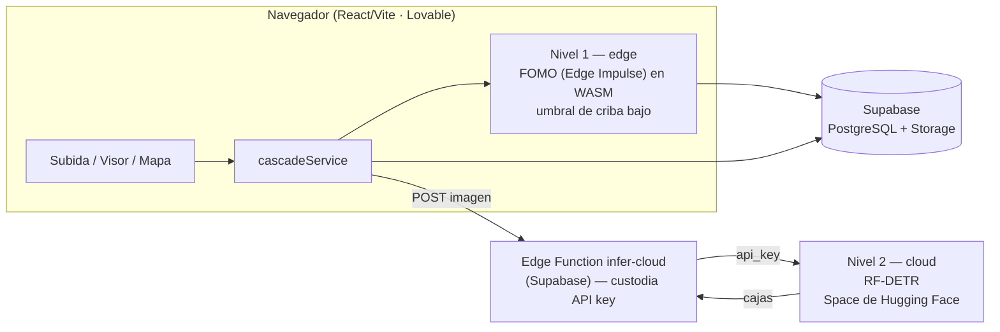
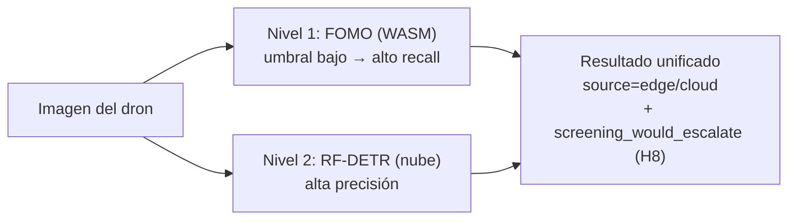
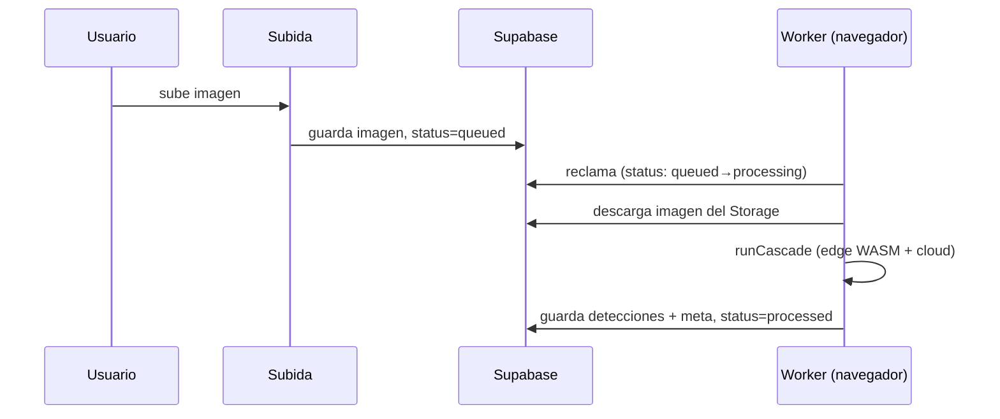

# Arquitectura de PlasticWatch (diagramas)

Fuente de verdad de los diagramas de arquitectura. Las versiones TikZ equivalentes están en
`anexoB_plasticwatch.tex` del TFM (Mermaid no compila en LaTeX sin pre-render). Estos se ven al
instante en GitHub / VS Code / mermaid.live.

## 1. Arquitectura de dos niveles

## 2. Flujo de inferencia en cascada (emulador comparativo)

Ambos niveles corren por imagen; la decisión de criba se registra, no corta el flujo.

## 3. Cola de inferencia con el navegador como worker (F6)

